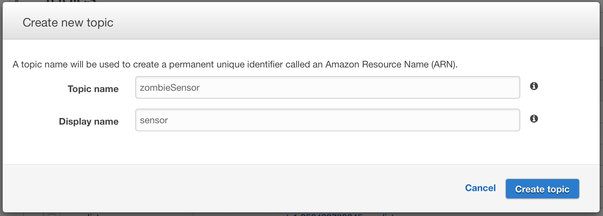

# Zombie Microservices Workshop: Lab Guide

## All Labs must be performed in us-west-2 (Oregon)

## Lab Overview
This workshop has several lab exercises that you can complete to extend the functionality of the base chat app that is provided when you launch the CloudFormation template provided. Each of these labs is an independent section and you may choose to do some or all of them.
*   **Typing Indicator**  
    This exercise already has the UI and backend implemented, and focuses on how to setup the API Gateway to provide a RESTful endpoint.
*   **SMS Integration with Twilio**  
    This exercise wires together Twilio to an existing API Gateway stack. It shows how you can leverage templates in API Gateway to transform form posted data into JSON format for the backend lambda function.
*   **Search over the chat messages**  
    This exercise adds an ElasticSearch cluster, which is used to index chat messages streamed from a DynamoDB table.
*   **Slack Integration**  
    This exercise integrates Slack into the chat application to send messages from Slack.
*   **Intel Edison Zombie Motion Sensor**  
    This exercise integrates motion sensor detection of zombies to the chat system using an Intel Edison board and a Grove PIR Motion Sensor.
*   **Workshop Cleanup**  
    This section points out some instructions to tear down your environment when you're done working on the labs. 

* * *

### 1\. Typing Indicator

The typing indicator shows up in the web chat client. It's a section above the post message input that shows when other survivors are typing. The UI and backend Lambda functions have been implemented, and this lab focuses on how to enable the feature in API Gateway.

The application uses CORS in order to query the API Gateway. This lab will both wire up the backend Lambda function as well as perform the necessary steps to enable CORS.

1\. Select the API Gateway Service from the main console page 
 

2\. Select the Zombie Workshop API Gateway 

3\. Go into the /zombie/talkers/GET method flow 
 

4\. Select the Integration Request component in the flow 

5\. Under Integration Type, Select Lambda Function 

6\. Select the us-west-2 region 

7\. Select the **_[CloudformationTemplateName]_**-GetTalkersFromDynamoDB-**_[XXXXXXXXXX]_** Function 

8\. Select Save and Grant access for API Gateway to invoke the Lambda function. 

9\. Click the Method Response section of the Method Execution Flow 

10\. Add a 200 HTTP Status response 
 

11\. Go to the /zombie/talkers/POST method 
 

12\. Perform Steps 4-10, but instead select the **_[CloudformationTemplateName]_**-WriteTalkersToDynamoDB-**_[XXXXXXXXXX]_** Lambda Function 

13\. Go to the /zombie/talkers/OPTIONS method 

14\. Select the Method Response 

15\. Add a 200 method response 

16\. Go back to the OPTIONS method flow and select the Integration Response 

17\. Select the Integration Response 

18\. Add a new Integration response with a method response status of 200 (leaving the regex blank) 

19\. Select the /zombie/talkers resource 
 

20\. Select "Enable CORS" in the top right 

21\. Select Enable and Yes to replace the existing values 
 

22\. Select Deploy API  
 

23\. Select the ZombieWorkshopStage deployment and hit the Deploy button. The typing indicator should now show when survivors are typing.  


* * *

### 2\. SMS Integration with Twilio

In this section, you’ll wire together Twilio with an existing API Gateway endpoint created in the CloudFormation stack, to bring SMS texting functionality into the Zombie Chat application.

1\. Sign up for a free trial Twilio account at https://www.twilio.com/try-twilio. 

2\. Once you have created your account, login to the Twilio console and navigate to the **Get Started with Phone Numbers** page as shown below. 
 

3\. Select the red **Get your first Twilio phone number** button to assign a phone number to your account. We’re going to generate a 10-digit phone number in this lab, but a short-code would also work if preferred. This number should be enabled for voice and messaging by default. 

4\. Once you’ve received a phone number, navigate to the **Manage Numbers** page and click on your phone number, which will take you to the properties page for that number. 

5\. Scroll to the bottom of the properties page, to the messaging section. In the **Configure With** section, select the **URL** radio button option. 

6\. Now you’ll retrieve your **/mobile** API endpoint from API Gateway and provide it to Twilio to hook up to AWS. Open the AWS Management console in a new tab, and navigate to API Gateway, as illustrated below. Be sure to leave the Twilio tab open as you’ll need it again to finish setup. 
 

7\. In the API Gateway console, select your API, **Zombie Workshop API Gateway**. On the top navigation bar, under Resources, click Stages, shown highlighted in orange below. 
 

8\. On the Stages page, expand the Resources tree on the left pane and select **POST** in the **/mobile** resource. The mobile resource is the endpoint that CloudFormation created for sms functionality. You should see an **Invoke URL** displayed for your /mobile resource, as shown below. 
 

9\. Copy the Invoke URL and return to Twilio. On the Twilio page you left open, paste the Invoke URL you copied from API Gateway into the **Request URL** field. Ensure that the request type is set to **HTTP POST**. This is illustrated below. 
 

10\. Finally, click **Save**. You are now ready to test out Twilio integration with your API. Send a text message to your Twilio phone number, you should receive a confirmation response text message and the message you sent should display in the web app chat room. You have successfully integrated Twilio text message functionality with API Gateway.

* * *

### 3\. Search over the chat messages

1\. Select the Amazon ElasticSearch icon from the main console page. 

2\. Create a new Amazon ElasticSearch domain. Provide it a name such as "zombiemessages". Click **Next**.

3\. On the **Configure Cluster** page, leave the default cluster settings and click **Next**. 

4\. For the access policy, select the **Allow or deny access to one or more AWS accounts or IAM users** option in the dropdown and fill in your account ID. Make sure **Allow** is selected for the "Effect" dropdown option. Click **OK**. 

5\. Select **Next** to go to the domain review page. 

6\. On the Review page, select **Confirm and create** to create your ElasticSearch cluster.

7\. The creation of the ElasticSearch cluster takes approximately 10 minutes. 

8\. Take note of the Endpoint once the cluster starts, we'll need that for the Lambda function. 
 

9\. Go into the Lambda service page by clicking on Lambda in the Management Console. 

10\. Select **Create a Lambda Function**. 

11\. Skip the Blueprint section by selecting the Skip button in the bottom right. 

12\. Fill in "ZombieWorkshopSearchIndexing" as the Name of the function. Keep the runtime as Node.js. You can set a description for the function if you'd like.

13\. Paste in the code from the ZombieWorkshopSearchIndexing.js file provided to you.

14\. On line 7 in the code provided, replace ENDPOINT_HERE with the ElasticSearch endpoint created in step 8\. Make sure it starts with https:// 

15\. Under the Role, create a new DynamoDB event stream role. When a new page opens confirming that you want to create a role, just click **Allow** to proceed. 

16\. Keep all the other defaults on the page set as is. Select **Next** and then on the Review page, select **Create function** to create your Lambda function. 

17\. Select the "Event Sources" tab for the new ZombieWorkshopSearchIndexing function. 

18\. Select **Add event source** 

19\. Select the DynamoDB Event source type and the **messages** DynamoDB table. You can leave the rest as the defaults.

20\. After creation, you should see an event source that looks like this 
 

21\. Now after you post messages in the chat, you can see them show up in the ElasticSearch indexing. You should be able to open Kibana from the URL provided in ElasticSearch Service and begin analyzing chat messages.  


* * *

### 4\. Slack Integration

* * *

### 5\. Motion Sensor Integration with Intel Edison and Grove

If you wish to utilize the Zombie Sensor as a part of the workshop, this guide will walk you through the following:

* Items required to create the physical Zombie sensor
* How to create the AWS backend (Simple Notification Service Topic) for the Zombie detector  
* How to install the code in the repo onto the device

**Please note that this section requires purchasing equipment if you are setting this up on your own outside of the workshop.** 

**Items Required** 

1\. One Intel® Edison and Grove IoT Starter Kit Powered by AWS. This can be purchased [here](http://www.amazon.com/gp/product/B0168KU5FK?*Version*=1&*entries*=0).  
2\. Within this start kit you will be using the following components for this exercise:  

* Intel® Edison for Arduino  
* Base Shield  
* USB Cable; 480mm-Black x1  
* USB Wall Power Supply x1  
* Grove - PIR Motion Sensor The application code is a very simple app that publishes a message to an Amazon Simple Notification Service (SNS) queue when motion is detected on the Grove PIR Motion Sensor. For the purpose of a workshop, this should be done only once in a central account by the workshop organiser, the topic will be made public so that the various teams are able to subscribe to this topic and make use of it during the workshop. 

``` {"message":"A Zombie has been detected in London!", "value":"1", "city":"London", "longtitude":"-0.127758", "lattitude":"51.507351"} ``` 

A simple workflow of this architecture is: 

Intel Edison -> Public SNS topic in central account -> Your AWS Lambda functions subscribed to the topic. 

####Creating the AWS Backend 

**If you are following this guide during a workshop presented by AWS, please ignore the following steps 2-4\. An SNS topic should already be configured for the workshop particants to consume messages from.** 

1\. Firstly, you will need to have an AWS Account. If you do not already have one, you can sign up [here](https://aws.amazon.com). 

2\. We will now create the SNS Topic. Navigate to the SNS product page within the AWS Management Console and click 'Topics' in the left hand menu. Then click on 'Create New Topic'. You will be presented with the following window. Fill in the fields with your desired values and click create topic. 
 

3\. You will now need to edit the topic polciy to permit any AWS account to subscribe lambda functions to your SNS topic. Check the check box next to your new topic, and then click Actions -> Edit topic policy. You need to configure these settings presented as per the below screenshot. Then click Update Policy. This step is what allows others (perhaps teammates working on this lab with you, to consume notifications from your SNS topic. 
 

4\. You now have your central SNS topic configured and ready to use. Ensure that you make a note of the Topic ARN and region where you have created the topic, you will need it in some of the following steps. 

####Installing the application on the Intel Edison 
**If you are following this guide during a workshop presented by AWS, please ignore this section. An Intel Edison board should already be configured for the workshop particants to consume messages from.** 

1\. First, You will need to get your Edison board set up. You can find a getting started guide for this on the Intel site [here](https://software.intel.com/en-us/articles/assemble-intel-edison-on-the-arduino-board). Note that for the purpose of this tutorial, we will be writing our client code for the Edison in node.js and will therefore be using the Intel® XDK for IoT (referred to as 'XDK' from here on) as our IDE. 

2\. You will need to physically connect the Grove PIR Motion Sensor to pin D6 on the breakout board. 

3\. Download all of the code from the 'zombieIntelEdisonCode' folder in this repository and store it in a folder locally on your machine. This simply consists of a main.js file (our application) and our package.json (our app dependencies). 

4\. Navigate to the homepage in the XDK and start a new project. 

5\. Choose to import an existing Node.js project and select the folder where you stored the code from this repository in the previous step. 

6\. Give your project a name. We called ours **zombieSensor**. 

7\. You now need to edit the code in main.js to include your AWS credentials and the SNS topic that you have created. Firstly, we'll need some AWS credentials. 

8\. You will need to create an IAM user with Access and Secret Access Keys for your Edison to publish messages to your SNS topic. There is a guide on how to create IAM users [here](http://docs.aws.amazon.com/IAM/latest/UserGuide/id_users_create.html). Your IAM policy for the user should look like the following: 

``` { "Version": "2012-10-17", "Statement": [ { "Action": [ "sns:Publish" ], "Effect": "Allow", "Resource": "ENTER YOUR SNS TOPIC ARN HERE" } ] } ``` 

9\. Now let's add your credentials to the client side code. Edit the following line in main.js to include your user access keys and the region where you have set up your SNS topic. 

``` AWS.config.update({accessKeyId: 'ENTER ACCESSKEY HERE', secretAccessKey: 'ENTER SECRET ACCESS KEY HERE', region: 'ENTER REGION HERE'}); ``` 

10\. Edit the following line in main.js to reflect the region in which you created the SNS topic. 

``` var sns = new AWS.SNS({region: 'ENTER REGION HERE'}); ``` 

11\. Edit the following line in main.js to reflect the Amazon Resource Name (ARN) of the SNS topic that you created earlier. 

``` TopicArn: "ENTER YOUR SNS TOPIC ARN HERE" ``` 

12\. You now need to connect the XDK to your Intel Edison device. There is a guide on the Intel site on how to do this [here](https://software.intel.com/en-us/getting-started-with-the-intel-xdk-iot-edition) under the 'Connect to your Intel® IoT Platform' section. 

13\. You now need to build the app and push it to your device. Firstly hit the build/install icon, this looks like a hammer in the XDK. It may take a couple of minutes to install the required packages etc. 

14\. Once the app has been built succesfully, you can run the app by pressing the run icon, this looks like a circuit board with a green 'play' sign. 

15\. Your app should now be running on the Edison device and your messages being published to the SNS topic. You can now consume this topic and do something meaningful with the Zombie alerts. You can consume these messages using AWS Lambda. There is some documentation to get you started [here](http://docs.aws.amazon.com/sns/latest/dg/sns-lambda.html). Continue below to learn how to integrate the SNS notifications into the chat application. 

####Consuming the SNS Topic Messages with AWS Lambda 

To help you get started consuming the Zombie Sensor data, We have created a sample lambda function in node.js that, once subscribed to the SNS topic as per the above mentioned documentation, simply consumes the messages and logs them to Cloudwatch logs. This sample can be found in this repository under lambda/exampleSNSFunction.js. Using the things learned in this workshop, can you develop a Lambda function that alerts survivors of zombies? 
In this section you will configure a Lambda function that triggers when messages are sent from the Edison device to the SNS topic. 

1\. Open up the Lambda console and create a new Lambda function.

2\. On the blueprints screen, search for "sns" in the blueprints search bar. Select the blueprint titled **sns-message**, which is a Nodejs function.

3\. On the next page, leave the event source type as SNS. For the SNS topic selection, either select the SNS topic you created earlier or if you are working in an AWS lab, insert the shared SNS topic ARN provided to you by the AWS workshop instructor. Click **Next**

4\. On the "configure function" screen, name your function (ie: ZombieSensorData).

5\. For the **Role**, select the "basic execution role" option. If another page opens asking you to confirm the creation of that role, click Allow through that. This role simply allows you to push events to CloudWatch Logs from Lambda.

6\. Leave all other options as default on the Lambda creation page and click **Next**.

7\. On the Review page, select the "Enable Now" radio button under **Enable event source**. This will enable your Lambda function to immediately begin consuming messages. Finally, click **Create function**.

8\. Once the function is created, on the overview page for your Lambda function, select the **Monitoring** tab and then on the right side select **View logs in CloudWatch**.

9\. You should now be on the CloudWatch Logs console page looking at the log streams for your Lambda function. 

10\. As data is sent to the SNS topic, it will kick off your function to consume the messages. The blueprint you used simply logs the message data to CloudWatch Logs. Verify that events are showing up in your CloudWatch Logs stream with Zombie Sensor messages from the Intel Edison. When you have confirmed that messages are showing up, now you need to get those alerts into the Chap application for survivors to see!

**HINT:** You'll want to edit your Lambda function to communicate with the **/messages** endpoint in API Gateway, which sends the messages to the **Messages** DynamoDB table so that the chat room can see the alerts when Zombies are detected. 

**If you are unable to complete this section and would like the solution with the complete Lambda function to finish this lab, please continue reading**.

**Solution with Code**

11\. To finish this section with our pre-built solution, open the **exampleSNSFunction.js** file from the workshop repo. Copy the entire contents of this JS file and overwrite your existing function with this code.

12\. In the code, modify the "host" variable under "post_options". Replace the string "INSERT YOUR API GATEWAY URL HERE" with your own API Gateway URL. It should look like **xxxxxxxx.execute-api.us-west-2.amazonaws.com**.

13\. Once you have overwritten your old code with the code provided by AWS, click the **Save** button to save your modified Lambda function. Almost immediately you should begin seeing zombie sensor alerts showing up in the chat room in the browser which means your messages are successfully sending from the Intel Edison device to AWS and into your chat app. This function takes the zombie sensor data, parses it, and sends it to your Chat Service with HTTPS POST requests to your **/messages** endpoint. Congrats!

### 5\. Workshop Cleanup

1\. To cleanup your environment, you can click "Delete Stack" to delete all the components that were launched as a part of the lab. However, the components that you manually launched in the above labs after the stack was created need to be deleted manually.

2\. Be sure to delete the ElasticSearch cluster and the associated Lambda function that you created for the ElasticSearch lab. 

3\. Be sure to delete the Lambda function created as a part of the Slack lab.

4\. Be sure to delete the SNS topic (if you created one) and the Lambda function that you created in the Zombie Sensor lab.

5\. Once those resources have been deleted, go to the CloudFormation console and find the Stack that you launched in the beginning of the workshop, select it, and click **Delete Stack**. When the stack has been successfully deleted, it should no longer display in the list of stacks. If you run into any issues deleting stacks, please notify a workshop instructor or contact [AWS Support](https://console.aws.amazon.com/support/home) for additional assistance. 

* * *
